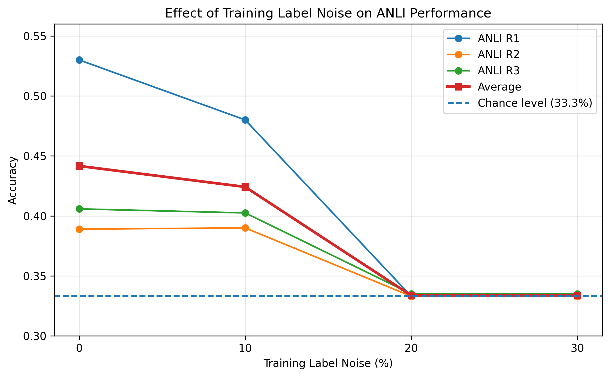

# ANLI Label Noise Experiment

This repository contains the code and experimental materials for the project:

**How Does Training Label Noise Affect NLI Performance on ANLI?**

The study examines how synthetic training-label noise affects the performance of RoBERTa-base on the Adversarial Natural Language Inference (ANLI) benchmark.

## Research Question

How does increasing synthetic training-label noise in ANLI training data affect the performance of RoBERTa-base on the ANLI R1, R2, and R3 development sets?

## Experimental Setup

- Model: RoBERTa-base
- Training sample: 30,000 ANLI training examples
- Noise conditions: 0%, 10%, 20%, and 30%
- Evaluation sets: ANLI R1, R2, and R3 development sets
- Metric: Accuracy

## Results

| Training label noise | R1 accuracy | R2 accuracy | R3 accuracy | Mean accuracy |
|---|---:|---:|---:|---:|
| 0% | 0.530 | 0.389 | 0.4058 | 0.4416 |
| 10% | 0.480 | 0.390 | 0.4025 | 0.4242 |
| 20% | 0.333 | 0.333 | 0.3350 | 0.3337 |
| 30% | 0.333 | 0.333 | 0.3350 | 0.3337 |

Average accuracy decreased as synthetic training-label noise increased. The decrease was modest at 10% noise, while the 20% and 30% conditions reached approximately one-third accuracy across the three ANLI development rounds.

For the 30% condition, an additional diagnostic showed that the model predicted a single class for every development example. The same diagnostic was not verified for the 20% condition, so no equivalent claim is made for that condition.

